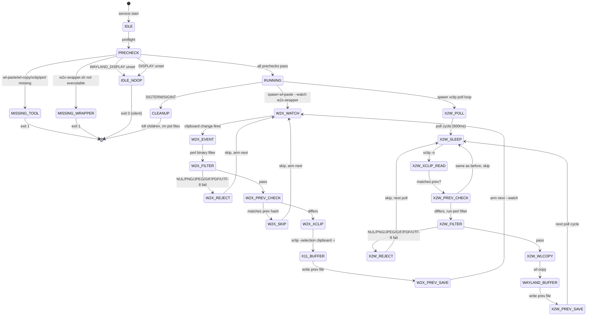

```mermaid
stateDiagram-v2
    [*] --> IDLE: service start

    IDLE --> PRECHECK: preflight
    PRECHECK --> IDLE_NOOP: WAYLAND_DISPLAY unset
    PRECHECK --> IDLE_NOOP: DISPLAY unset
    PRECHECK --> MISSING_TOOL: wl-paste/wl-copy/xclip/perl missing
    PRECHECK --> MISSING_WRAPPER: w2x-wrapper.sh not executable
    PRECHECK --> RUNNING: all prechecks pass

    MISSING_TOOL --> [*]: exit 1
    MISSING_WRAPPER --> [*]: exit 1
    IDLE_NOOP --> [*]: exit 0 (silent)

    RUNNING --> W2X_WATCH: spawn wl-paste --watch w2x-wrapper
    RUNNING --> X2W_POLL: spawn xclip poll loop

    W2X_WATCH --> W2X_EVENT: clipboard change fires
    W2X_EVENT --> W2X_FILTER: perl binary filter
    W2X_FILTER --> W2X_REJECT: NUL/PNG/JPEG/GIF/PDF/UTF-8 fail
    W2X_FILTER --> W2X_PREV_CHECK: pass

    W2X_PREV_CHECK --> W2X_SKIP: matches prev hash
    W2X_PREV_CHECK --> W2X_XCLIP: differs
    W2X_XCLIP --> X11_BUFFER: xclip -selection clipboard -i
    X11_BUFFER --> W2X_PREV_SAVE: write prev file
    W2X_PREV_SAVE --> W2X_WATCH: arm next --watch
    W2X_REJECT --> W2X_WATCH: skip, arm next
    W2X_SKIP --> W2X_WATCH: skip, arm next

    X2W_POLL --> X2W_SLEEP: poll cycle (600ms)
    X2W_SLEEP --> X2W_XCLIP_READ: xclip -o
    X2W_XCLIP_READ --> X2W_PREV_CHECK: matches prev?
    X2W_PREV_CHECK --> X2W_SLEEP: same as before, skip
    X2W_PREV_CHECK --> X2W_FILTER: differs, run perl filter
    X2W_FILTER --> X2W_REJECT: NUL/PNG/JPEG/GIF/PDF/UTF-8 fail
    X2W_FILTER --> X2W_WLCOPY: pass
    X2W_WLCOPY --> WAYLAND_BUFFER: wl-copy
    WAYLAND_BUFFER --> X2W_PREV_SAVE: write prev file
    X2W_PREV_SAVE --> X2W_SLEEP: next poll cycle
    X2W_REJECT --> X2W_SLEEP: skip, next poll

    RUNNING --> CLEANUP: SIGTERM/SIGINT
    CLEANUP --> [*]: kill children, rm pid files
```
